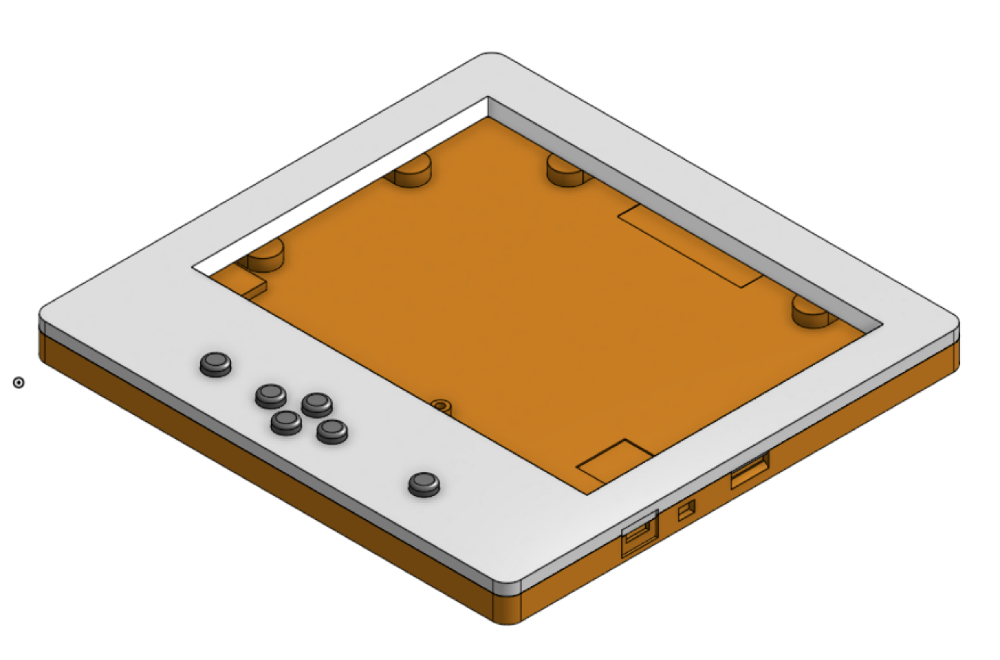
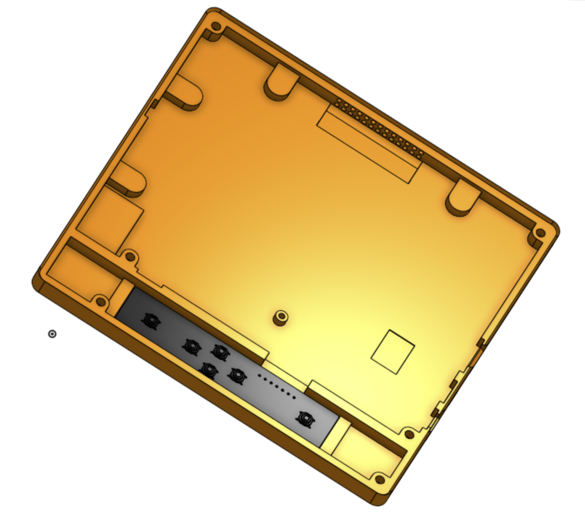

# InkPlate-6-Extended-Case

This is a change to the current InkPlate-6 case to add a small electronic board with push buttons below the mainboard. To do it, I took the original design from e-Radionica and extended a side of it, so the original portion of the case remains unchanged. The `Mechanical CAD` folder contains the complete STEP format design as well as the STL files ready for 3D printing. The `Electronics` folder contains the Gerber files for the preparation of the pc-board, as well as the schematic in PDF. I have used **OnShape** and **KiCAD** to complete this project.

- For the STL files, dimensions are in millimeters. 
- Six buttons must be printed as well as the top and bottom casing.
- The connection with the MCU23017 is done using wirewrap wires (or a flat cable) that are soldered at both ends using the following configuration (beware that the corresponding buttons numbers are inverted in the sequence):

```
   On the   |     On the     | Corresponding 
Buttons PCB | InkPlate Board |    Button
------------+----------------+---------------
            |                |
   Pin 1    |      GND       |
   Pin 2    |      GPB2      |      U6
   Pin 3    |      GPB3      |      U3
   Pin 4    |      GPB4      |      U5
   Pin 5    |      GPB5      |      U1
   Pin 6    |      GPB6      |      U4
   Pin 7    |      GPB7      |      U2
```

- The three touch pads must be disabled, the corresponding signals from the MCU23017 are diverted to the GPBx pin holes on the pc-board. This is done by desoldering the current jumpers and soldering them back on the other side. They are located under the following labeling on the board: "Touch pads".
- The corresponding GPIOB I/O bits corresponding to the GPB2-7 pins of the MCU23017 must have their internal pull-up resistor enabled.
- The buttons' pc-board must be of a standard height (1.6 mm). This to ensure proper spacing for the buttons. The board must be 'glued' at the bottom of the main casing using two-sided scotch tape. An alternative would be using a very small amount of hot glue on the 4 corners on the top of the buttons' pc-board. This is to permit easy removal in case of problems. The buttons part number is C&K PTS526 SK15 SMTR2 LFS 5.2x5.2x1.5 mm. They are very common (For exemple, Mouser part # 611-PTS526SK15SMR2L, Digikey Part # CKN12221-1-ND, or other manufacturers).

The original licensing from e-Radionica remains GPL-3 for their design as well as all supplied files in this project.



